# Network Monitoring & Security Operations Lab

**Author:** Saketh Thokala  
**Project Type:** Cybersecurity & Network Security Lab  
**Platform:** Cisco Packet Tracer

## Overview
This project demonstrates an enterprise-style network security and monitoring environment built in Cisco Packet Tracer. It covers VLAN segmentation, inter-VLAN routing, SSH remote management, switch port security, unused-port hardening, ACL enforcement, centralized Syslog monitoring, and security verification.

## Objectives
- Build a multi-VLAN enterprise-style network.
- Configure inter-VLAN routing using R2 router-on-a-stick.
- Configure a dedicated management VLAN.
- Secure access ports with sticky MAC port security.
- Disable unused switch ports.
- Configure SSH version 2 for secure remote management.
- Enforce traffic restrictions using an extended ACL.
- Centralize device logs using Syslog.
- Verify connectivity and security controls.

## Network Devices
| Device | Type | Role |
|---|---|---|
| R1-EDGE | Cisco 2911 | Simulated edge/upstream router |
| R2-CORE | Cisco 2911 | Inter-VLAN routing, ACL and Syslog |
| SW1-HQ | Cisco 2960 | Core/distribution switching |
| SW2-HQ | Cisco 2960 | HR/Finance access |
| SW3-ACCESS | Cisco 2960 | Sales/IT access |
| SW4-ACCESS | Cisco 2960 | Server/Management access |
| SRV1-MONITORING | Server-PT | Central Syslog server |
| PC1–PC10 | PC-PT | HR, Finance, Sales, IT and Admin endpoints |

## VLAN and IP Addressing Plan
| VLAN | Department | Network | Gateway |
|---|---|---|---|
| 10 | HR | 10.10.10.0/24 | 10.10.10.1 |
| 20 | Finance | 10.10.20.0/24 | 10.10.20.1 |
| 30 | Sales | 10.10.30.0/24 | 10.10.30.1 |
| 40 | IT | 10.10.40.0/24 | 10.10.40.1 |
| 50 | Servers | 10.10.50.0/24 | 10.10.50.1 |
| 99 | Management | 10.10.99.0/24 | 10.10.99.1 |

### Endpoint Addressing
- HR: PC1 `10.10.10.10`, PC2 `10.10.10.11`
- Finance: PC3 `10.10.20.10`, PC4 `10.10.20.11`
- Sales: PC5 `10.10.30.10`, PC6 `10.10.30.11`
- IT: PC7 `10.10.40.10`, PC8 `10.10.40.11`
- Admin: PC9 `10.10.99.10`, PC10 `10.10.99.11`
- Monitoring Server: `10.10.50.10`

### Router Transit
- R1-EDGE G0/1: `10.255.255.1/30`
- R2-CORE G0/1: `10.255.255.2/30`
- Simulated upstream on R1 G0/0: `203.0.113.2/30`

## Security Controls

### VLAN Segmentation
Separate VLANs are used for HR, Finance, Sales, IT, Servers, and Management to create logical network boundaries.

### Inter-VLAN Routing
R2-CORE provides the default gateway for each VLAN using subinterfaces on G0/0.

### SSH Remote Management
R2 and all switches were configured for SSH version 2 with local authentication. Credentials are intentionally not included in this documentation.

### Port Security
Active access ports use:
- Port security enabled
- Maximum one MAC address
- Sticky MAC learning
- Violation mode `restrict`

### Unused-Port Hardening
Unused switch interfaces were administratively shut down to reduce unnecessary exposure.

### ACL Enforcement
The extended ACL `HR-RESTRICTION` is applied inbound on R2 G0/0.10.

Policy:
- Deny HR (`10.10.10.0/24`) to Finance (`10.10.20.0/24`)
- Permit HR traffic to other destinations

Verification showed the deny counter increasing for HR-to-Finance traffic while HR-to-Server traffic was permitted.

### Centralized Syslog
R2 and the switches send Syslog messages to `10.10.50.10` using UDP port 514. R2 verification showed the logging destination up and informational trap logging.

## Verification Commands
```text
show ip interface brief
show vlan brief
show interfaces trunk
show ip access-lists HR-RESTRICTION
show logging
show ip ssh
show port-security interface
```

## Evidence Screenshots

The following screenshots provide direct visual evidence of the network configuration, security controls, monitoring, and final verification.

### 01. Enterprise Topology

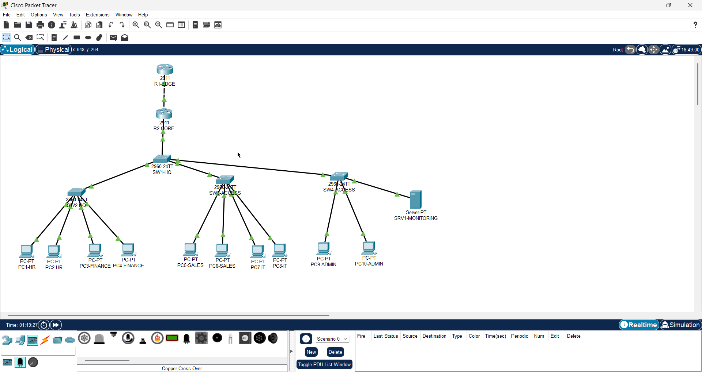

### 02. Management VLAN Verification

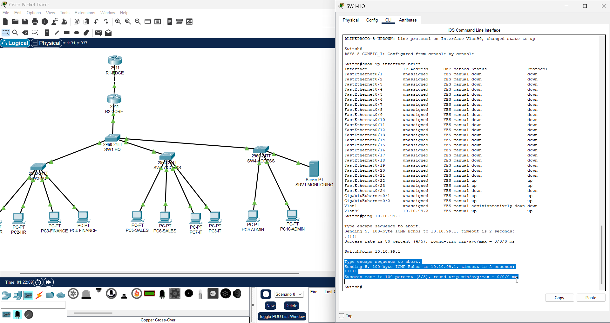

### 03. SW2 Management Verification

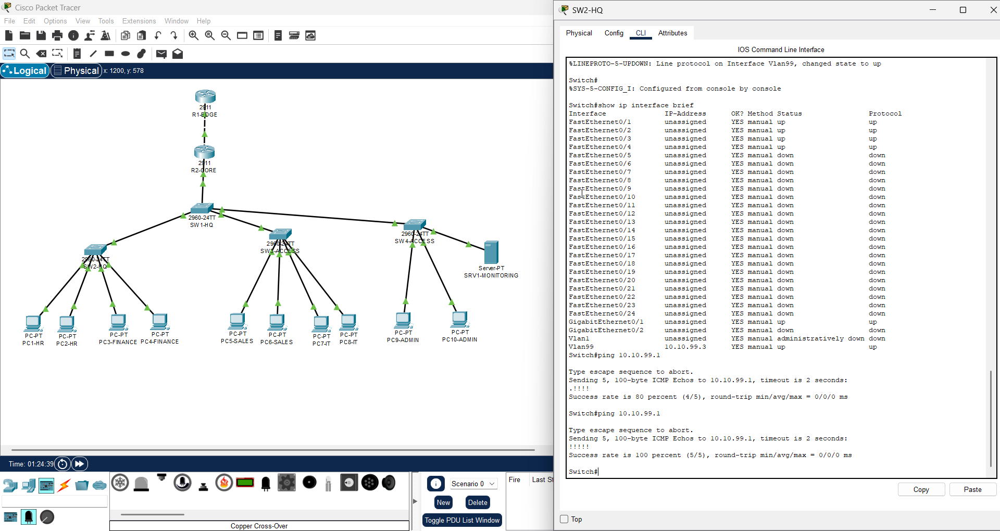

### 04. SW3 Management Verification

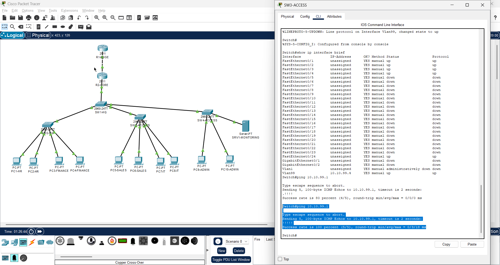

### 05. SW4 Management Verification

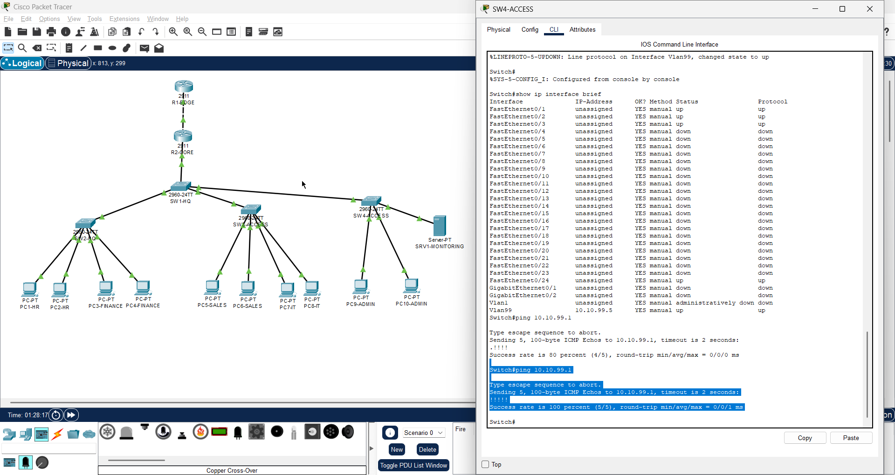

### 06. SSH Remote Management

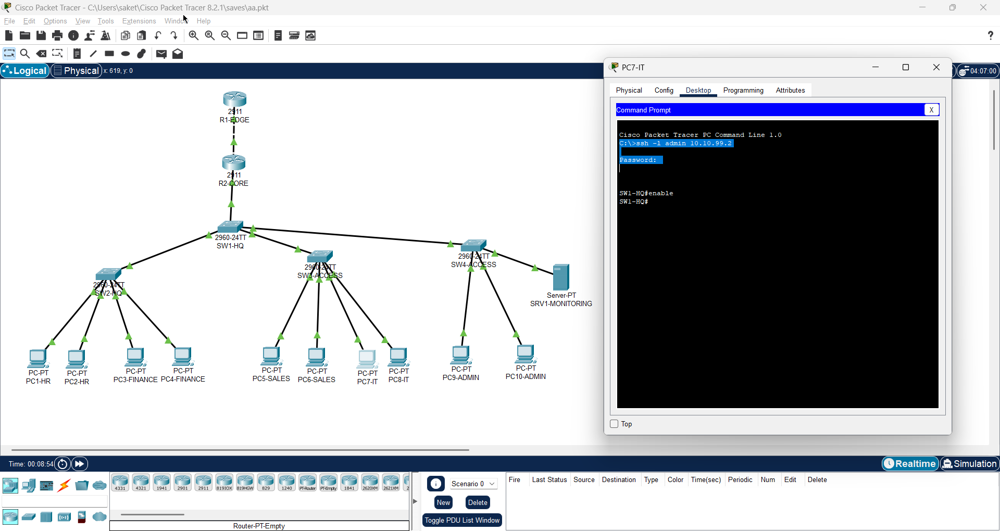

### 07. Port Security Baseline

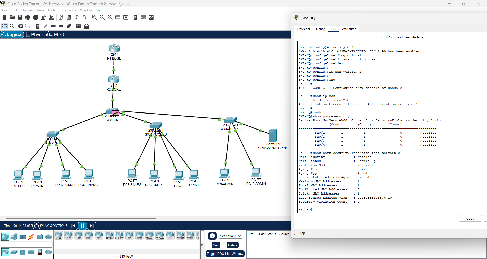

### 08. ACL Enforcement

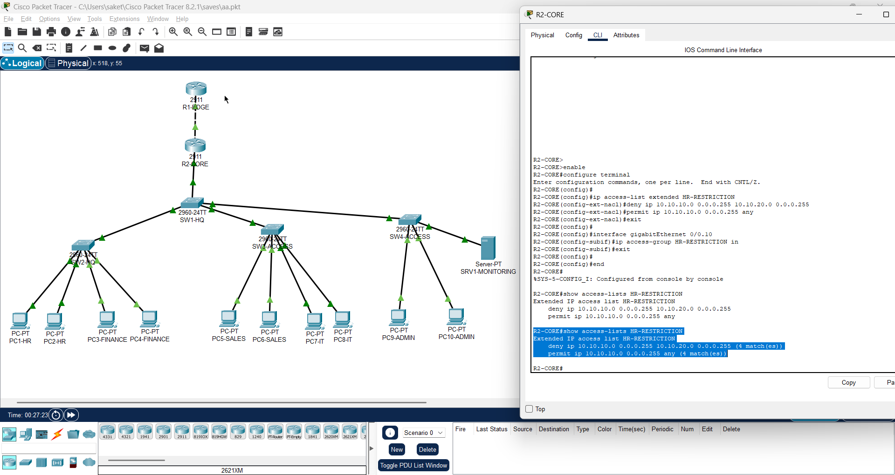

### 09. ACL Policy Verification

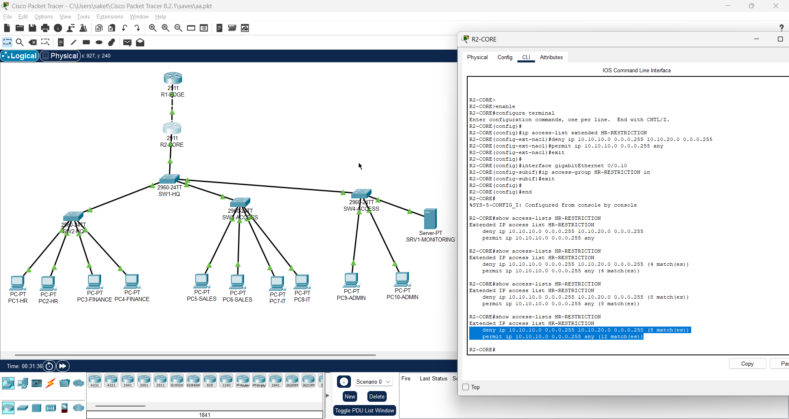

### 10. Syslog R2 Verification

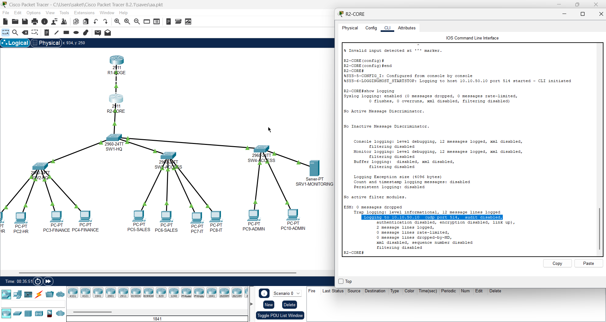

### 11. Central Syslog Verification

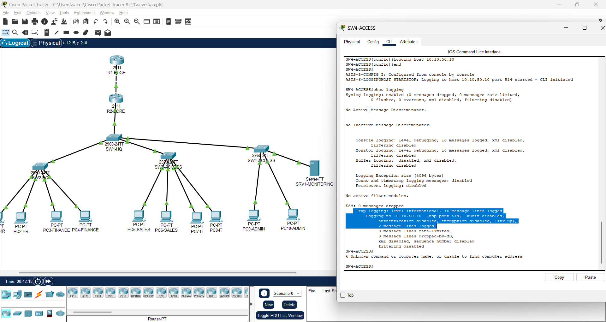

### 12. Syslog Server Configuration

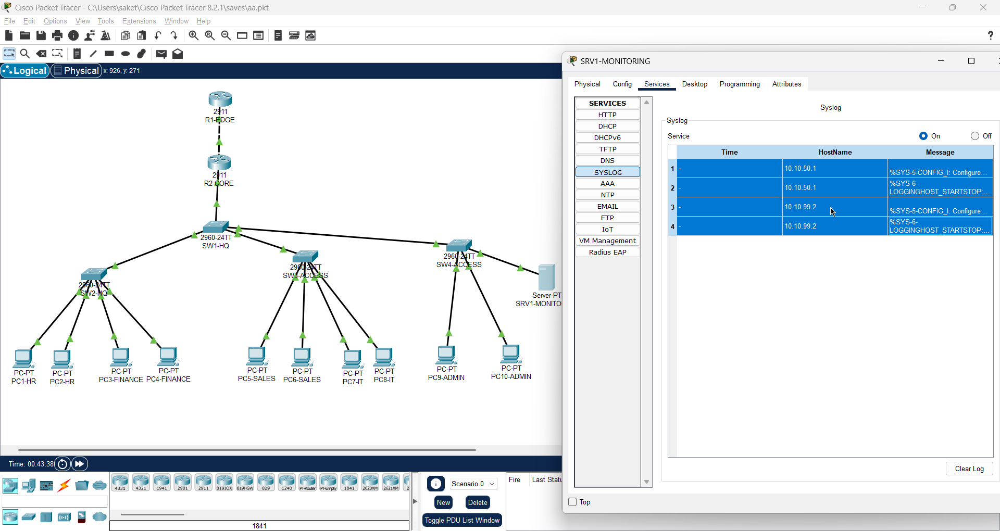

### 13. Final R2 Security Verification

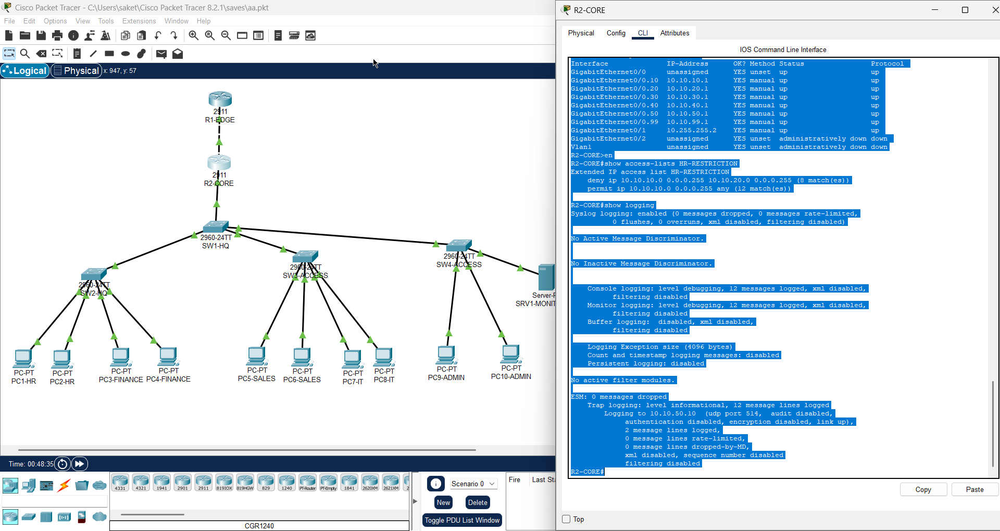

## Project Structure
```text
Network-Monitoring-Security-Operations-Lab/
├── Network-Monitoring-Security-Operations-Lab.pkt
├── README.md
├── Network-Monitoring-Security-Operations-Lab.pdf
├── Network-Monitoring-Security-Operations-Lab.docx
└── screenshots/
```

## Skills Demonstrated
Cisco Packet Tracer, Cisco IOS, TCP/IP, IPv4, VLANs, trunking, inter-VLAN routing, extended ACLs, SSH, port security, network hardening, Syslog monitoring, troubleshooting, security verification, and technical documentation.

## Note
This is a simulated Cisco Packet Tracer lab intended to demonstrate practical networking and defensive security concepts rather than represent a production deployment.
